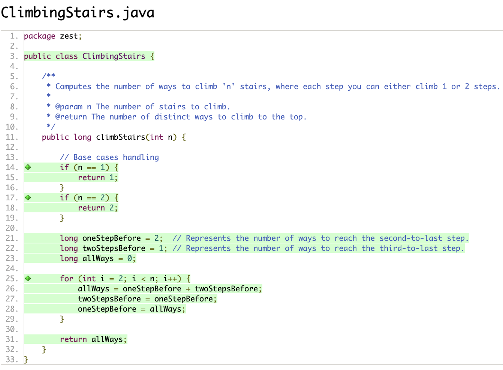
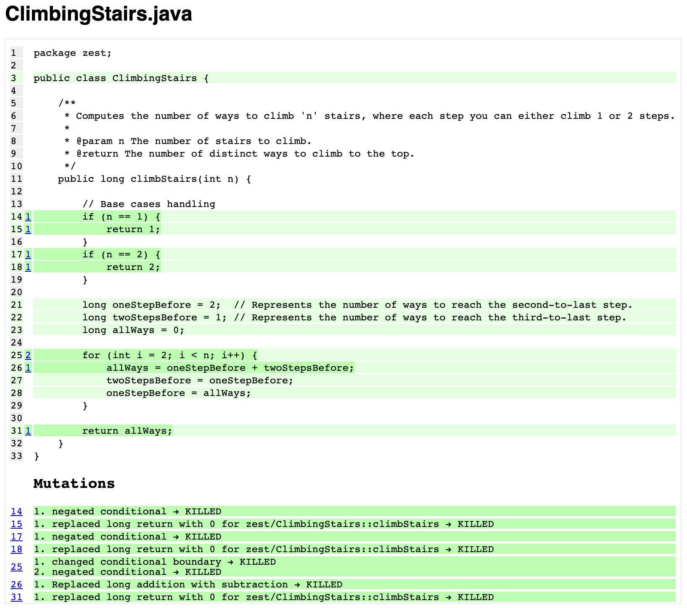
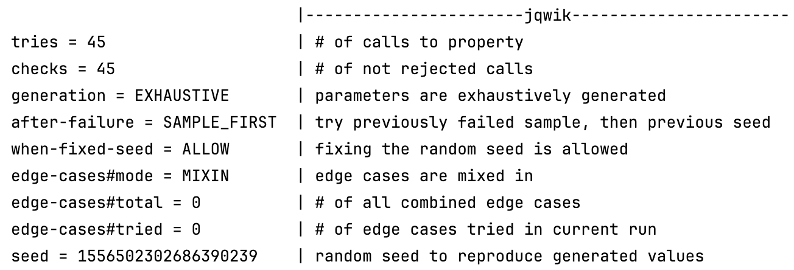
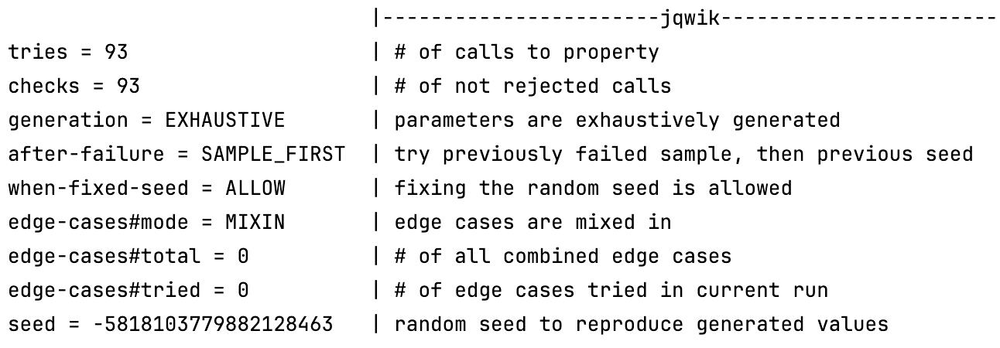

# Solution for Array Rotator

## Task 1: Code Coverage
- Line + Branch Coverage

- Mutation Coverage

## Task 2: Designing Contracts
### Pre-conditions:
- n must be a positive integer
- the number of steps, are fixed between 1 and 2

### Post-conditions:
- the program returns the number of unique ways to climb the staircase with n steps using 1 or 2 steps
- the output is a positive number, as there is at least one way to climb the staircase

### Invariants:
- at each iteration i the variables *oneStepBefore* and *twoStepsBefore* store the number of ways to reach steps i and i-1
- *allWays* always stores the number of ways to reach step i+1

## Task 3: Testing Contracts 
The pre-conditions are met and the post-conditions hold.
Also, invariants are maintained.

## Task 4: Property-Based Testing
- Checking for all small numbers 

- checking for large numbers 
