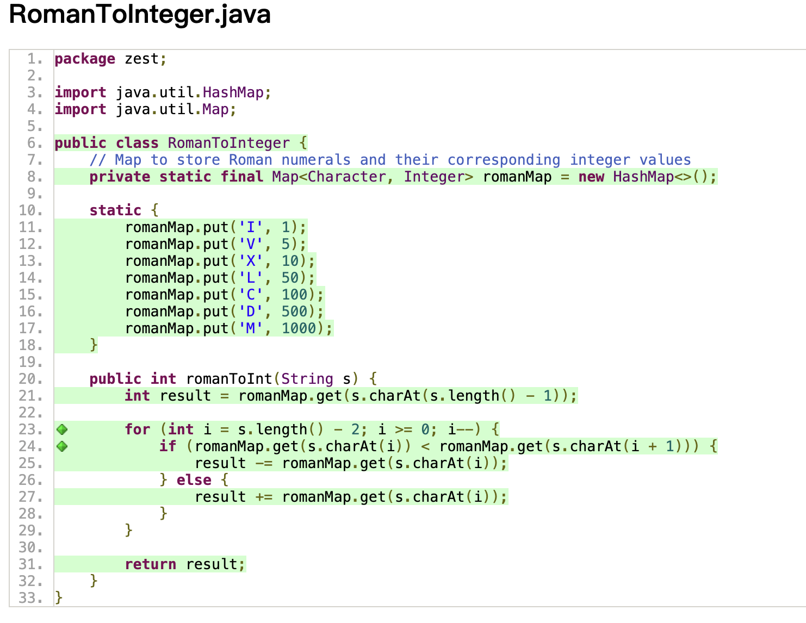
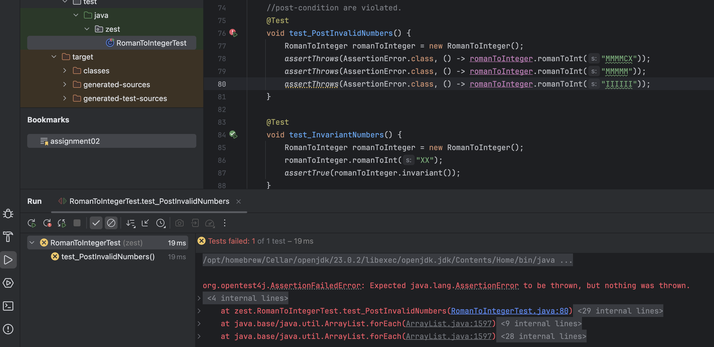
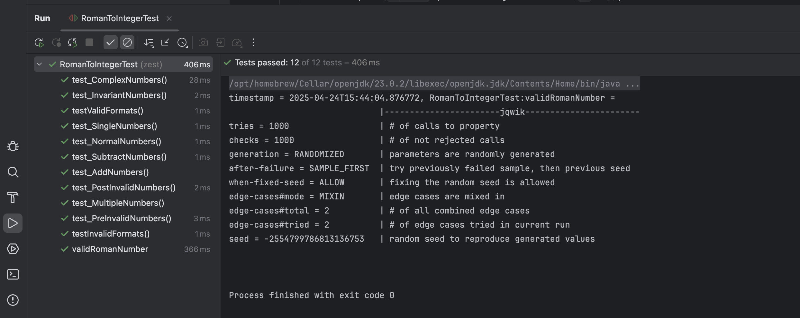
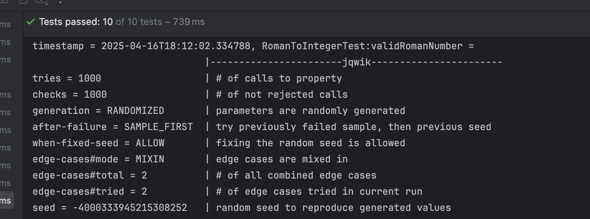

## Problem: RomanToInteger

# Task 1 Code Coverage

Based on structural testing, we wrote line coverage, branch coverage, path coverage.

Result: 100% coverage


# Task 2 Designing Contracts
### pre-condition
```java
assert s != null && !s.isEmpty() : "String cannot be null or empty";

assert s.matches("[IVXLCDM]+") : "Invalid Roman numeral characters";
```
### post-condition
```java
assert result >= 1 && result <= 3999 : "Result out of range";
```
### invariant
```java
    private void checkInvariant() {
        assert invariant() : "Roman numeral mapping errored";
    }

    private boolean invariant() {
        return romanMap.size() == 7;
    }

//invariant at the start public method
checkInvariant();
//invariant at the end public method
checkInvariant();
```
# Task 3 Testing Contracts
I add four more test based on pre-condition, post-condition and invariant.
as we can see

```java
   //normal operation when pre-conditions are met.
    @Test
    void test_NormalNumbers() {
        RomanToInteger romanToInteger = new RomanToInteger();
        //meet the pre-condition
        assertEquals(5, romanToInteger.romanToInt("V"));
        assertEquals(17, romanToInteger.romanToInt("XVII"));
        //meet the post-condition
        //boundary test
        assertEquals(1, romanToInteger.romanToInt("I"));
        assertEquals(3999, romanToInteger.romanToInt("MMMCMXCIX"));
    }
    //pre-conditions are violated.
    @Test
    void test_PreInvalidNumbers() {
        RomanToInteger romanToInteger = new RomanToInteger();
        assertThrows(AssertionError.class, () -> romanToInteger.romanToInt(null));
        assertThrows(AssertionError.class, () -> romanToInteger.romanToInt(""));
        assertThrows(AssertionError.class, () -> romanToInteger.romanToInt("MAMA"));
    }
    //post-condition are violated.
    @Test
    void test_PostInvalidNumbers() {
        RomanToInteger romanToInteger = new RomanToInteger();
        assertThrows(AssertionError.class, () -> romanToInteger.romanToInt("MMMMCX"));
        assertThrows(AssertionError.class, () -> romanToInteger.romanToInt("MMMMM"));
        assertThrows(AssertionError.class, () -> romanToInteger.romanToInt("IIIIII"));
    }

    @Test
    void test_InvariantNumbers() {
        RomanToInteger romanToInteger = new RomanToInteger();
        romanToInteger.romanToInt("XX");
        assertTrue(romanToInteger.invariant());
    }


```
all the added test passed except postinvalidnumbers()


it says nothing was thrown, when input roman number is "IIIIII"
Missing post-condition check for Roman numeral format validity. In this case, 

Therefore, I need to add new post-conditions to prevent problems with the formatting rules of Roman numerals.
```java
assert isValidRomanFormat(s, result) : "Invalid Roman numeral format";

private boolean InvalidRomanFormat(String s) {
    return s.matches(".*I{4}.*|.*X{4}.*|.*C{4}.*|.*M{4}.*") ||  //consecutive 4 numbers
            s.matches(".*V{2}.*|.*L{2}.*|.*D{2}.*");           // repetitive numbers
}
```
So I also added the corresponding test, as shown below.

```java
    @Test
    void testValidFormats() {
        RomanToInteger converter = new RomanToInteger();
        assertEquals(3, converter.romanToInt("III"));
        assertEquals(4, converter.romanToInt("IV"));
    }

    @Test
    void testInvalidFormats() {
        RomanToInteger converter = new RomanToInteger();
        assertThrows(AssertionError.class, () -> converter.romanToInt("IIII"));
        assertThrows(AssertionError.class, () -> converter.romanToInt("VV"));
    }
```
Eventually, all the tests passed.

# Task 4 Property-Based Testing
based on the PBT, I wrote test code
- Use regular expression filtering to ensure the generated string is a valid Roman numeral
- Limit the length to between 1 and 15 characters (the actual maximum length of a Roman numeral is 15 characters)
```java
  @Property
    void validRomanNumber(@ForAll("RomanNumbers") String roman) {
        RomanToInteger romanToInteger = new RomanToInteger();
        int result = romanToInteger.romanToInt(roman);
        assertTrue(result >= 1 && result <= 3999);
    }

    @Provide
    Arbitrary<String> RomanNumbers() {
        return Arbitraries.strings()
                .withChars('I', 'V', 'X', 'L', 'C', 'D', 'M')
                .ofMinLength(1).ofMaxLength(15)
                .filter(s -> s.matches("^M{0,3}(CM|CD|D?C{0,3})(XC|XL|L?X{0,3})(IX|IV|V?I{0,3})$"));
    }
```

result:
