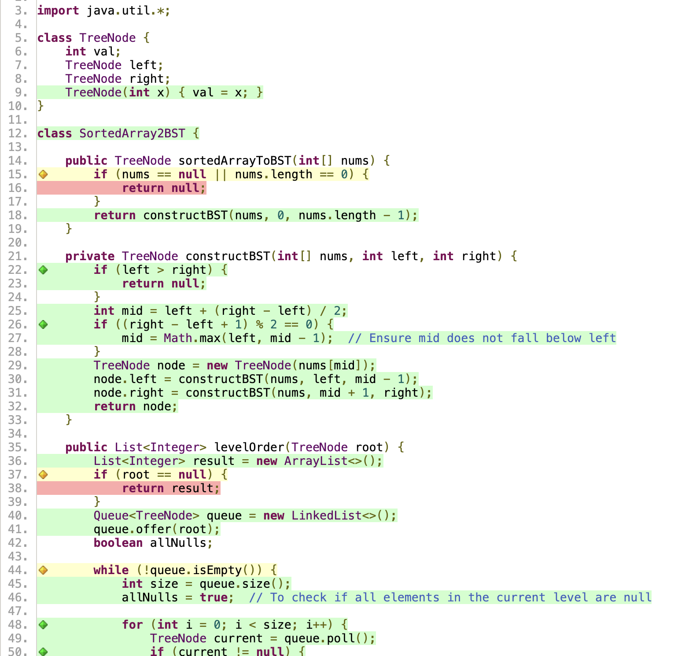
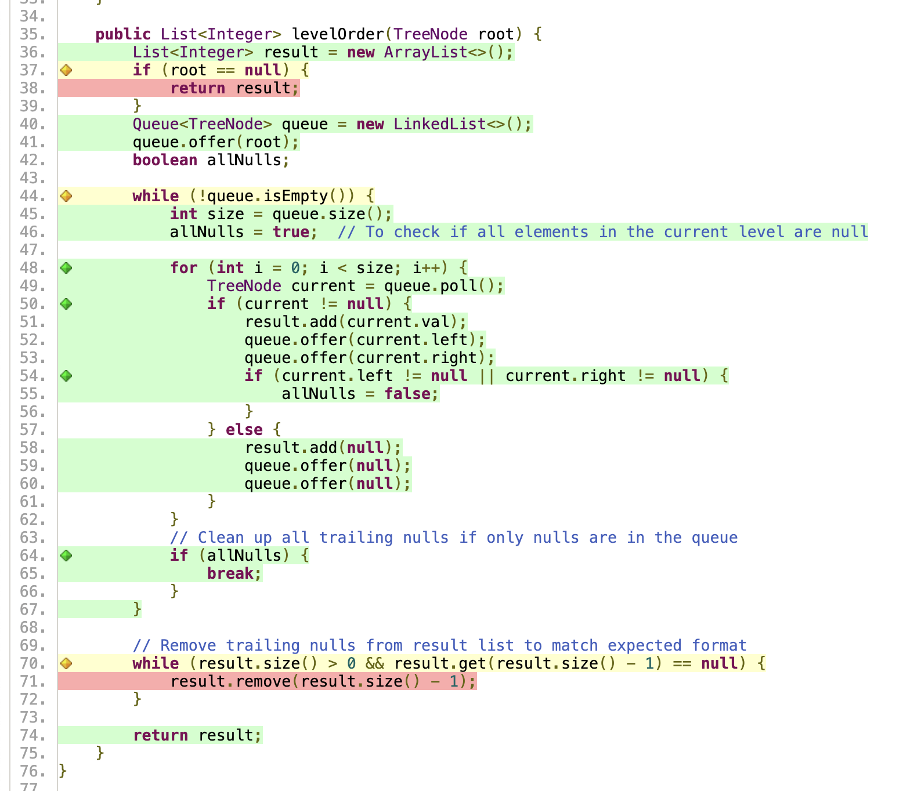
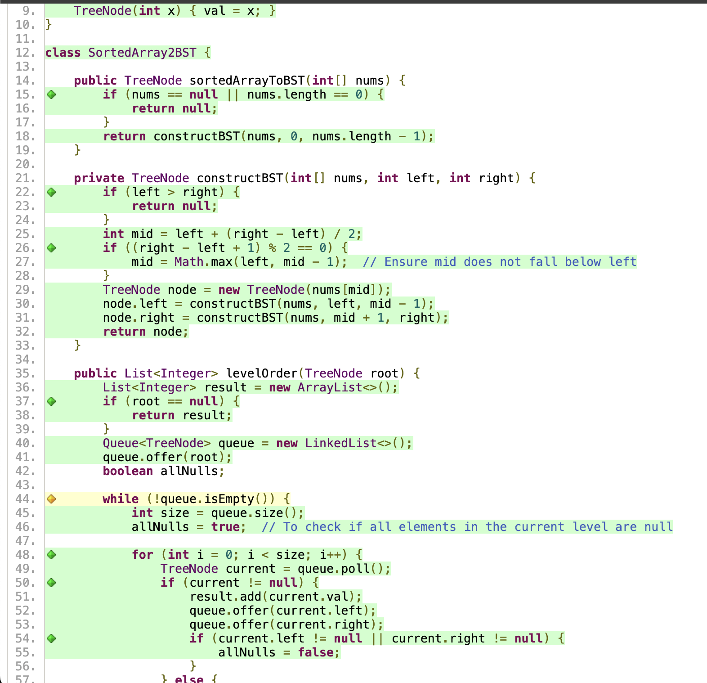
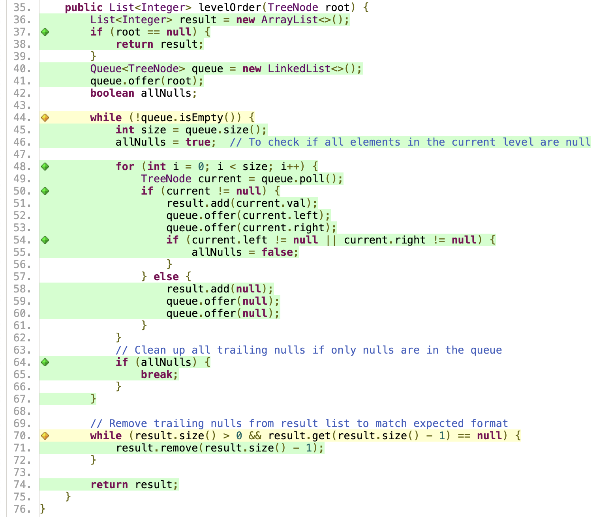

## Problem: RomanToInteger

# Task 1 Code Coverage

first, i wrote 5 tests, but the jacoco showing 50% missed branches.



Therefore, i added more tests to complete code coverage
```java
    @Test
    // added missing branches tests
    void test_EmptySortedArray() {
        TreeNode root = converter.sortedArrayToBST(new int[]{});
        assertNull(root);
    }
    @Test
    void test_NullSortedArray() {
        TreeNode root = converter.sortedArrayToBST(null);
        assertNull(root);
    }
    @Test
    void test_LevelNullSortedArray() {
        List<Integer> result = converter.levelOrder(null);
        assertTrue(result.isEmpty());
    }
    @Test
    void test_TrainingNullSortedArray() {
        List<Integer> expected = Arrays.asList(-3, -2, null, 1);
        TreeNode root = new TreeNode(-3);
        root.left = new TreeNode(-2);
        root.left.left = new TreeNode(1);
        List<Integer> actual = converter.levelOrder(root);
        assertEquals(expected, actual);
    }
    @Test
    void test_TrainingWithoutNullSortedArray() {
        List<Integer> expected = Arrays.asList(-3, -2, null, 1);
        TreeNode root = new TreeNode(-3);
        root.left = new TreeNode(-2);
        root.left.left = new TreeNode(1);
        List<Integer> actual = converter.levelOrder(root);
        assertEquals(expected, actual);

    }
```
Then I regenerated jacoco report, as you can see below.
it fixed the red lines, and 2 yellow lines.


# Task 2 Designing Contracts
### pre-condition
```java
assert s != null && !s.isEmpty() : "String cannot be null or empty";

assert s.matches("[IVXLCDM]+") : "Invalid Roman numeral characters";
```
### post-condition
```java
assert result >= 1 && result <= 3999 : "Result out of range";
```
### invariant
```java
    private void checkInvariant() {
        assert invariant() : "Roman numeral mapping errored";
    }

    private boolean invariant() {
        return romanMap.size() == 7;
    }

//invariant at the start public method
checkInvariant();
//invariant at the end public method
checkInvariant();
```
# Testing Contracts
I add four more test based on pre-condition, post-condition and invariant.
as we can see

```java
   //normal operation when pre-conditions are met.
    @Test
    void test_NormalNumbers() {
        RomanToInteger romanToInteger = new RomanToInteger();
        //meet the pre-condition
        assertEquals(5, romanToInteger.romanToInt("V"));
        assertEquals(17, romanToInteger.romanToInt("XVII"));
        //meet the post-condition
        //boundary test
        assertEquals(1, romanToInteger.romanToInt("I"));
        assertEquals(3999, romanToInteger.romanToInt("MMMCMXCIX"));
    }
    //pre-conditions are violated.
    @Test
    void test_PreInvalidNumbers() {
        RomanToInteger romanToInteger = new RomanToInteger();
        assertThrows(AssertionError.class, () -> romanToInteger.romanToInt(null));
        assertThrows(AssertionError.class, () -> romanToInteger.romanToInt(""));
        assertThrows(AssertionError.class, () -> romanToInteger.romanToInt("MAMA"));
    }
    //post-condition are violated.
    @Test
    void test_PostInvalidNumbers() {
        RomanToInteger romanToInteger = new RomanToInteger();
        assertThrows(AssertionError.class, () -> romanToInteger.romanToInt("MMMMCX"));
        assertThrows(AssertionError.class, () -> romanToInteger.romanToInt("MMMMM"));
    }

    @Test
    void test_InvariantNumbers() {
        RomanToInteger romanToInteger = new RomanToInteger();
        romanToInteger.romanToInt("XX");
    }

```
all the added test passed.


# Property-Based Testing
based on the PBT, I wrote test code
- Use regular expression filtering to ensure the generated string is a valid Roman numeral
- Limit the length to between 1 and 15 characters (the actual maximum length of a Roman numeral is 15 characters)
```java
  @Property
    void validRomanNumber(@ForAll("RomanNumbers") String roman) {
        RomanToInteger romanToInteger = new RomanToInteger();
        int result = romanToInteger.romanToInt(roman);
        assertTrue(result >= 1 && result <= 3999);
    }

    @Provide
    Arbitrary<String> RomanNumbers() {
        return Arbitraries.strings()
                .withChars('I', 'V', 'X', 'L', 'C', 'D', 'M')
                .ofMinLength(1).ofMaxLength(15)
                .filter(s -> s.matches("^M{0,3}(CM|CD|D?C{0,3})(XC|XL|L?X{0,3})(IX|IV|V?I{0,3})$"));
    }
```
result:
