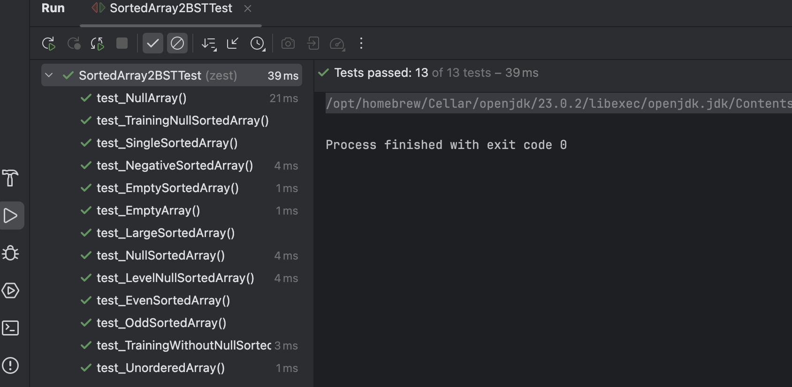
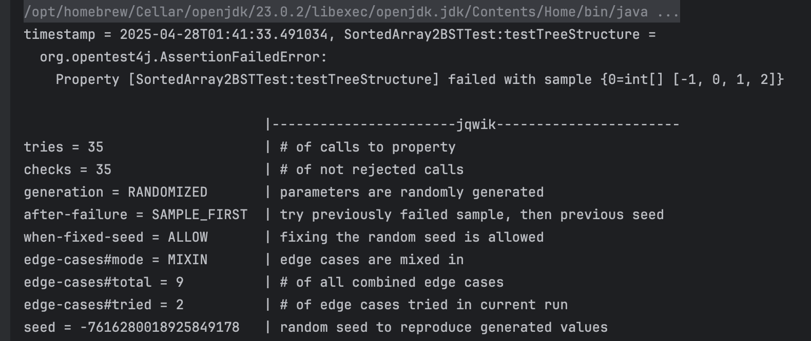

## Problem: RomanToInteger

# Task 1 Code Coverage

first, i wrote 5 tests, but the jacoco showing 50% missed branches.


Therefore, i added more tests to complete code coverage
```java
    @Test
    // added missing branches tests
    void test_EmptySortedArray() {
        TreeNode root = converter.sortedArrayToBST(new int[]{});
        assertNull(root);
    }
    @Test
    void test_NullSortedArray() {
        TreeNode root = converter.sortedArrayToBST(null);
        assertNull(root);
    }
    @Test
    void test_LevelNullSortedArray() {
        List<Integer> result = converter.levelOrder(null);
        assertTrue(result.isEmpty());
    }
    @Test
    void test_TrainingNullSortedArray() {
        List<Integer> expected = Arrays.asList(-3, -2, null, 1);
        TreeNode root = new TreeNode(-3);
        root.left = new TreeNode(-2);
        root.left.left = new TreeNode(1);
        List<Integer> actual = converter.levelOrder(root);
        assertEquals(expected, actual);
    }
    @Test
    void test_TrainingWithoutNullSortedArray() {
        List<Integer> expected = Arrays.asList(-3, -2, null, 1);
        TreeNode root = new TreeNode(-3);
        root.left = new TreeNode(-2);
        root.left.left = new TreeNode(1);
        List<Integer> actual = converter.levelOrder(root);
        assertEquals(expected, actual);

    }
```
Then I regenerated jacoco report, as you can see below.
it fixed the red lines, and 2 yellow lines.


# Task 2 Designing Contracts
### pre-condition
```java
if (nums == null) {
    throw new IllegalArgumentException("Input array cannot be null");
}
if (nums.length == 0) {
    throw new IllegalArgumentException("Input array cannot be empty");
}
if (!isStrictlyIncreasing(nums)) {
    throw new IllegalStateException("Input array must be strictly increasing");
}
private boolean isStrictlyIncreasing(int[] nums) {
    for (int i = 0; i < nums.length - 1; i++) {
        if (nums[i] >= nums[i + 1]) {
            return false;
        }
    }
    return true;
}

```

# Testing Contracts
I add more tests based on pre-condition, post-condition and invariant.
as we can see

```java
    @Test
void test_NullArray() {
    int[] nums = null;
    IllegalArgumentException thrown = assertThrows(IllegalArgumentException.class,
            () -> converter.sortedArrayToBST(nums));
    assertEquals("Input array cannot be null", thrown.getMessage());
}

@Test
void test_EmptyArray() {
    int[] nums = {};
    IllegalArgumentException thrown = assertThrows(IllegalArgumentException.class,
            () -> converter.sortedArrayToBST(nums));
    assertEquals("Input array cannot be empty", thrown.getMessage());
}

@Test
void test_UnorderedArray() {
    int[] nums = {1, 3, 2}; // Not strictly increasing
    IllegalStateException thrown = assertThrows(IllegalStateException.class,
            () -> converter.sortedArrayToBST(nums));
    assertEquals("Input array must be strictly increasing", thrown.getMessage());
}

```
all the added test passed.


# Property-Based Testing

result:
