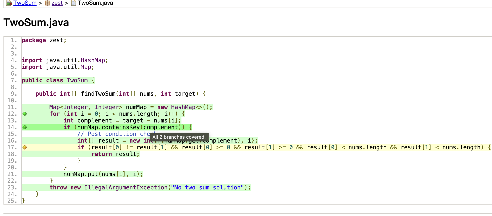
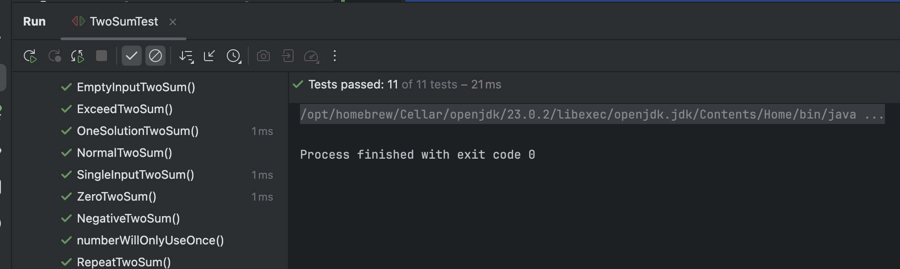
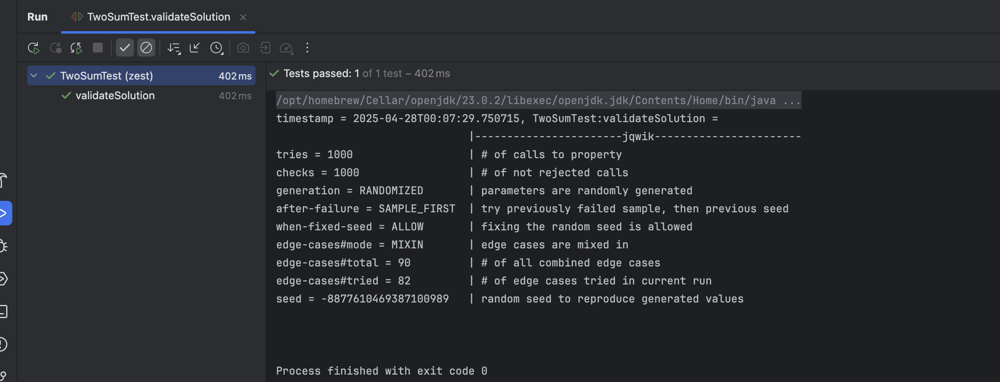

## Problem: ToSum

# Task 1 Code Coverage

Based on structural testing, we wrote line coverage, branch coverage, path coverage.

Result: 



# Task 2 Designing Contracts
### pre-condition
```java
    if (nums == null || nums.length < 2) {
    throw new IllegalArgumentException("Input array is null or empty, or less than 2 elements in array");
}
```
### post-condition
```java
    if (result[0] == result[1]) {
    throw new IllegalStateException("used the same element twice");
    }
```
### invariant
```java
    //invariant check before
    checkInvariants(numMap, nums, i);

    //invariant check after
    checkInvariants(numMap, nums, i);
    
private void checkInvariants(Map<Integer, Integer> numMap, int[] nums, int i) {
    if (i < 0 || i >= nums.length) {
        throw new IllegalStateException(
                String.format("Current index is out of array",
                        i, nums.length)
        );
    }
}
```
# Task 3 Testing Contracts
I add  more tests based on pre-condition, post-condition and invariant.
as we can see

```java
   //normal operation when pre-conditions are met.
// post-condition
@Test
void OneSolutionTwoSum() {
    int[] arr = {-5, -3, 3, 5};
    int target = 0;
    int[] result = solver.findTwoSum(arr, target);
    Assertions.assertArrayEquals(new int[]{1, 2}, result, "Each input will have exactly one solution");
    assertFalse(Arrays.equals(new int[]{0, 1, 2, 3}, result));
}

@Test
void numberWillOnlyUseOnce() {
    int[] arr = {2, 6, 3, 1};
    int target = 4;
    int[] result = solver.findTwoSum(arr, target);
    Assertions.assertArrayEquals(new int[]{2, 3}, result);
    assertFalse(Arrays.equals(new int[]{0, 0}, result), "You may not use the same element of the array twice.");
}
//pre-conditions
@Test
void NullInputTwoSum() {
    int[] arr = null;
    int target = 23;
    assertThrows(IllegalArgumentException.class, () -> solver.findTwoSum(arr, target), "Input cannot be null");
}

@Test
void EmptyInputTwoSum() {
    int[] arr = {};
    int target = 23;
    assertThrows(IllegalArgumentException.class, () -> solver.findTwoSum(arr, target), "Input cannot be empty");
}


@Test
void SingleInputTwoSum() {
    int[] arr = {1};
    int target = 2;
    assertThrows(IllegalArgumentException.class, () -> solver.findTwoSum(arr, target), "Input cannot be a single number");
}


```
all the added test passed


# Task 4 Property-Based Testing

```java
  @Property
boolean validateSolution(@ForAll List<Integer> nums, @ForAll int target) {
    if (nums == null || nums.size() < 2) {
        return true;
    }

    try {
        // Convert List<Integer> to int[]
        int[] numsArray = nums.stream().mapToInt(Integer::intValue).toArray();
        int[] result = solver.findTwoSum(numsArray, target);

        return result[0] != result[1] &&
                result[0] >= 0 && result[0] < numsArray.length &&
                result[1] >= 0 && result[1] < numsArray.length &&
                numsArray[result[0]] + numsArray[result[1]] == target;

    } catch (IllegalArgumentException ex) {
        return true;
    }
}
```

result:

