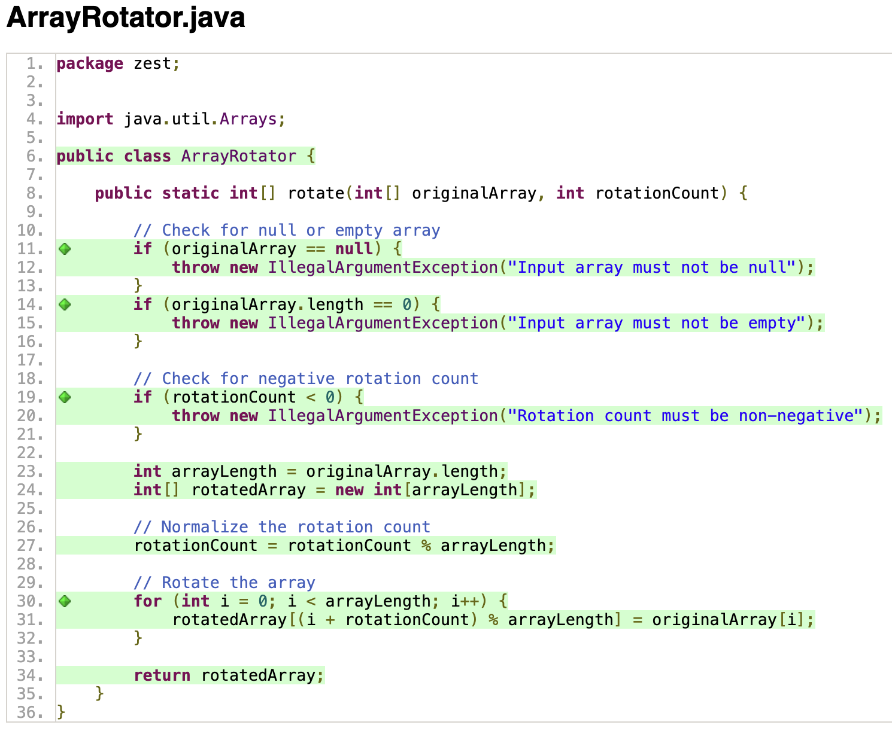
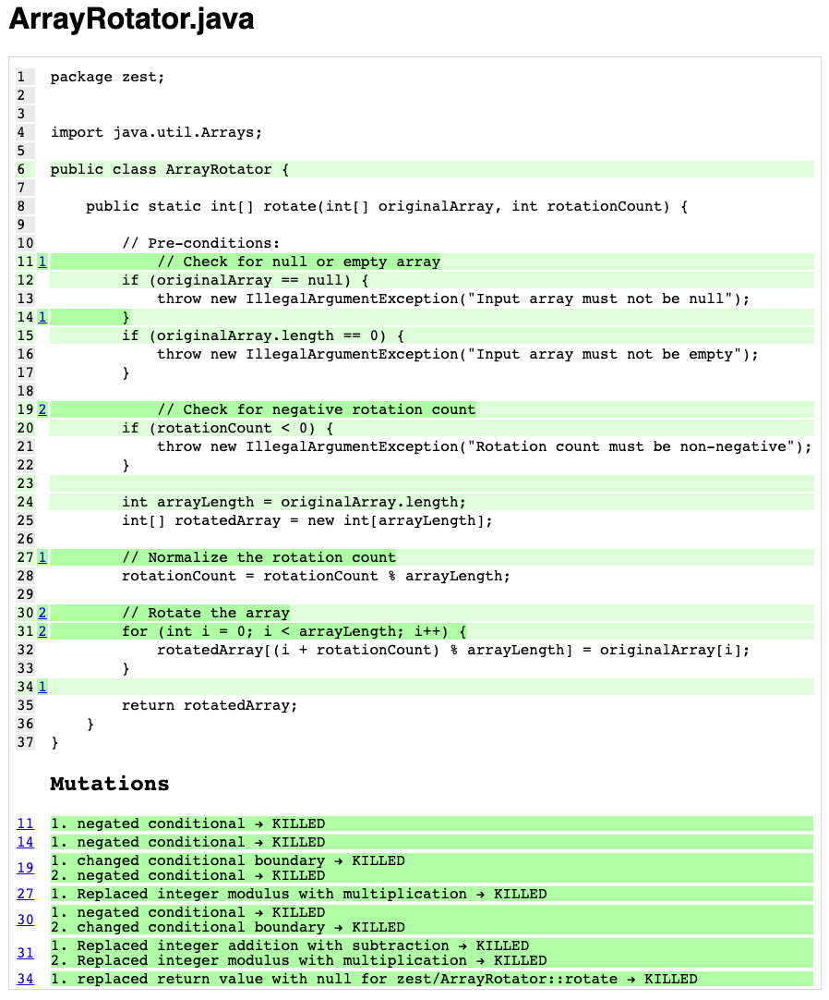
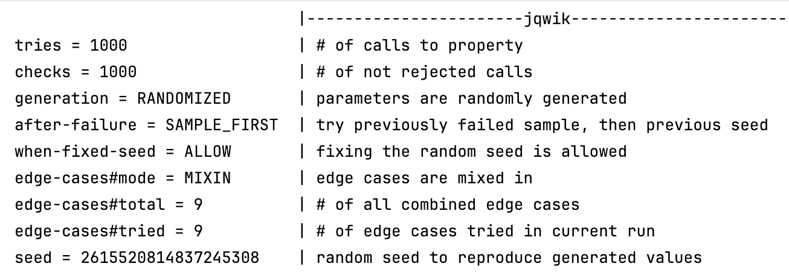
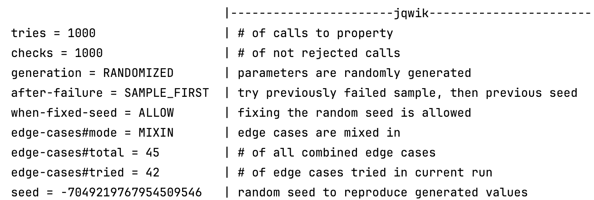
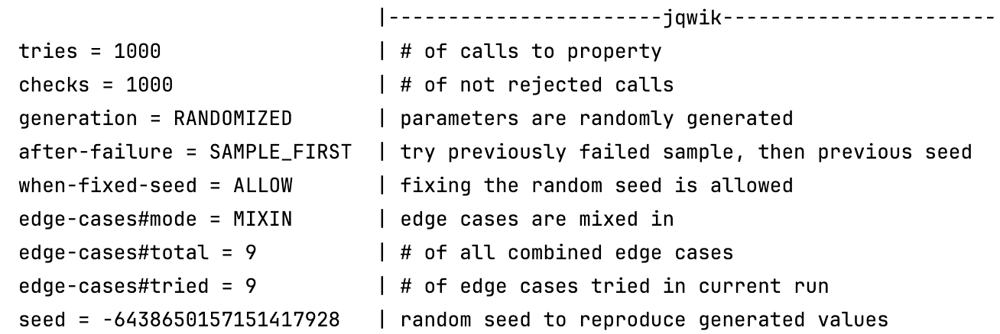

# Solution for Array Rotator

Array Rotator program takes an input array and rotates it to the right by a given number of rotations.
The rotation is circular, meaning that elements shifted out of the array on the right reappear at the start.
The program did not check for a negative amount of rotations, and if the array was null or empty. So, these checks have been added to the original code.

## Task 1: Code Coverage
The ArrayRotator.java has 100% Code Coverage.
However, it's written only 13/19 because it also takes into consideration the Main.java file, which should not be covered.
There is 100% mutation coverage, with all mutations killed.

## Task 2: Designing Contracts
### Pre-conditions:
- array must be non-empty
- array must not be null
- the number of rotations must be positive 

### Post-conditions:
- if the rotation count is 0, the original array must be returned unchanged
- else, it must return the expected modified array after rotations 

### Invariants:
- the number of rotations must be the same 
- the length of the resulting array must be equal to the input array
- the resulting array must contain the same elements as the input array

## Task 3: Testing Contracts 
In the tested program, pre- and post-conditions are met and hold. 
Also, the invariants are maintained.

## Task 4: Property-Based Testing
- When there are no rotations:

- When the number of rotations is the same as the length of the array

- Check whether after applying the rotation, there any changes in the ouput array
