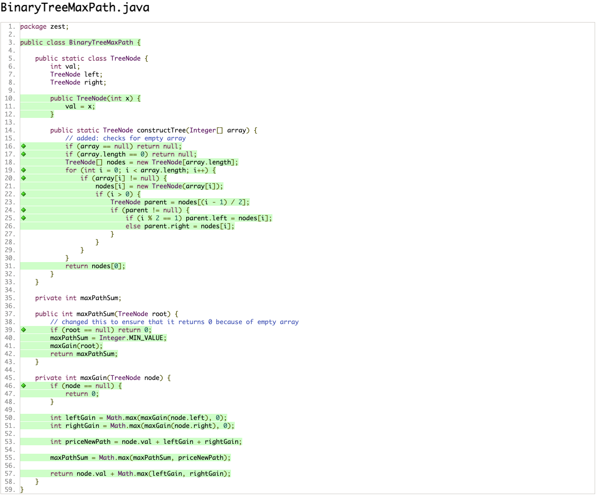
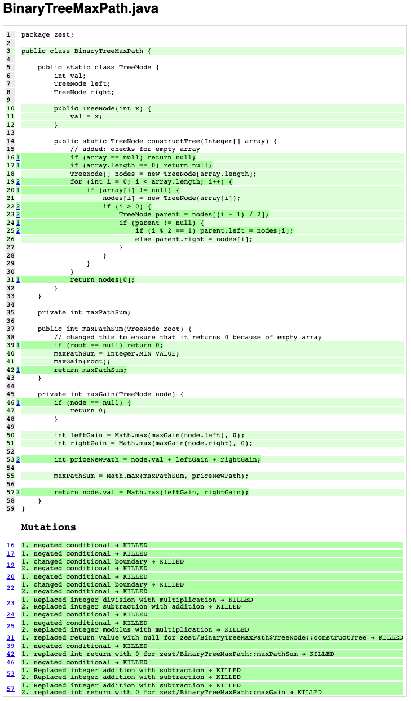
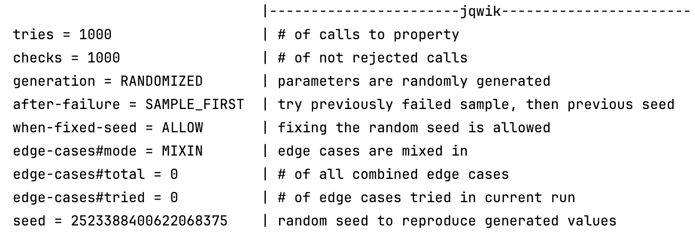
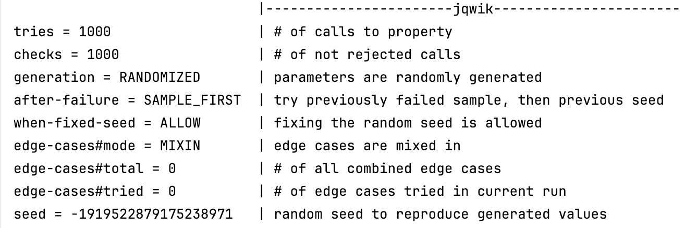
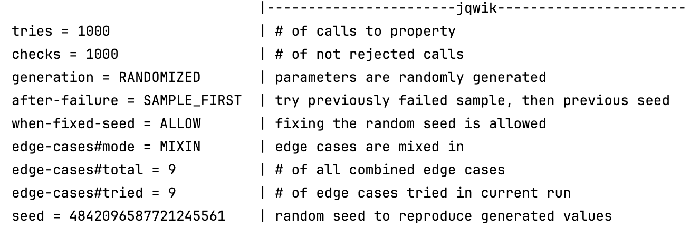

# Solution for Array Rotator

## Task 1: Code Coverage

## Task 2: Designing Contracts
### Pre-conditions:
- tree must be made of integers and/or null values
- the length must be between 0 and 1023
- each integer must be between -10^4 and 10^4
- for each node at index i:
  - its left child is located at 2*i + 1
  - its right child at 2*i + 2, if within bounds of the array length

### Post-conditions:
- the program must return the maximum path sum in the tree
- the path can start and end at any nodes, but it must follow the parent-child connection
- the path must contain at least one node which is not null
- when the tree is empty, the function return 0

### Invariants:
- each node is either an integer or null
- parent-child relationships are maintained
- maxPathSum variable must always be the highest sum found so far

## Task 3: Testing Contracts 

In the tested program, pre- and post-conditions are met and hold. Also, the invariants are maintained.

## Task 4: Property-Based Testing
Given the conditions, a *@Provide* keyword was introduced (it is commented in the BinaryTreeMaxPathTest.java). 
However, finding the max node value in a randomly-generated list, brought us to use a method max() for a *stream*, which returns an OptionalInt. This last with the implementation gave NullPointerException, which we could not fix. For this reason, *@Provide* was not used.   

The elements checked were:
- When tree is null

- When array is empty

- When there is one element
 