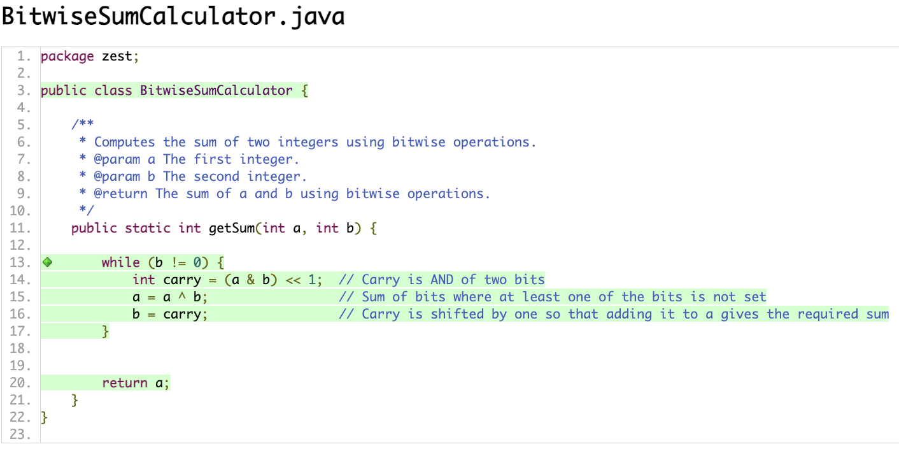
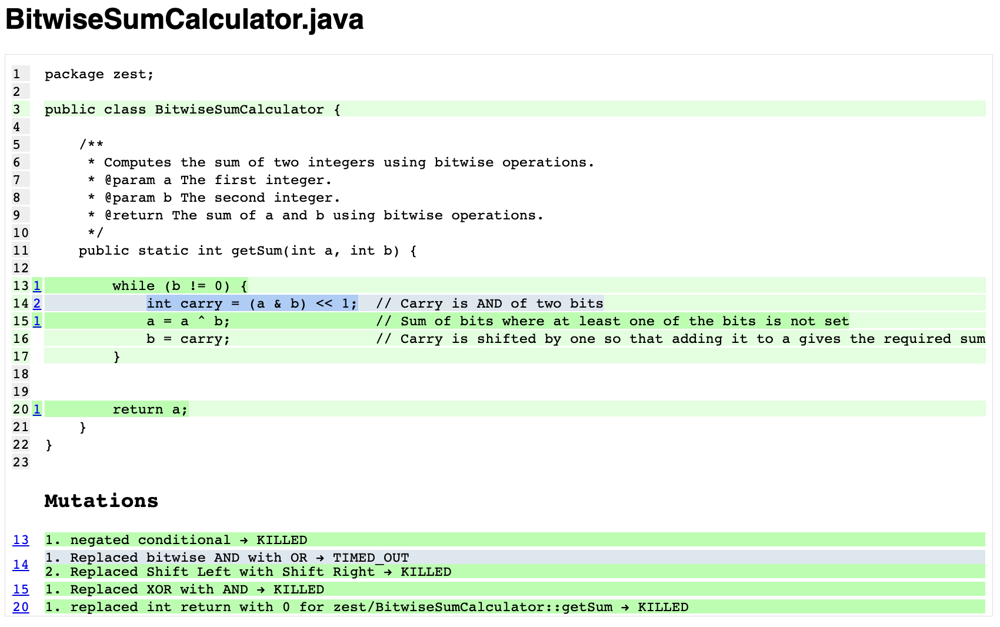
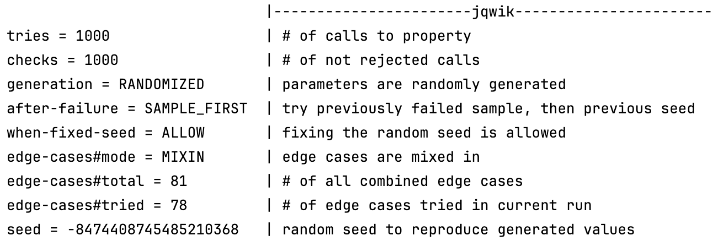
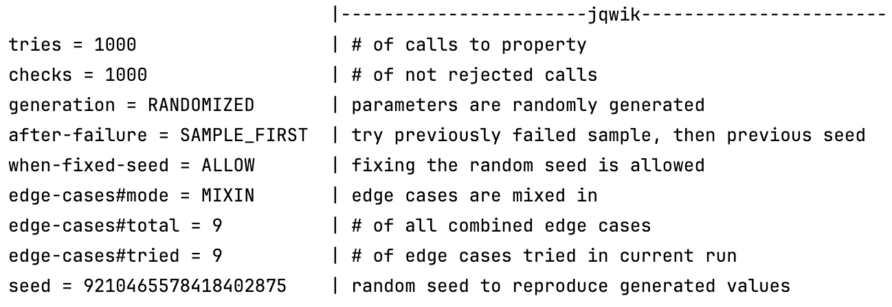

# Solution for Array Rotator

## Task 1: Code Coverage
- Line + Branch Coverage

- Mutation Coverage
There is a timeout because the while(b!=0) may loop forever.

This could be avoided by adding a limited number of iterations in the while loop. 
### Pre-conditions:
- a and b are signed integers

### Post-conditions:
- the returned value from the sum

### Invariants:
- at each iteration, b decreases up to the point where no carries remain.

## Task 3: Testing Contracts 
Pre-conditions are met and post-conditions hold.
Also, invariants are maintained.

## Task 4: Property-Based Testing 
### Properties that hold true:
- Testing sum

- Testing with 0 

- Testing symmetry
