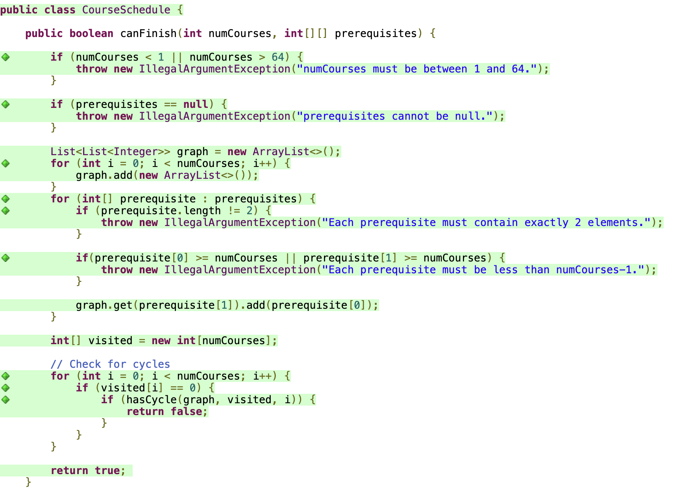
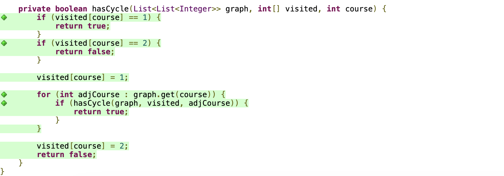
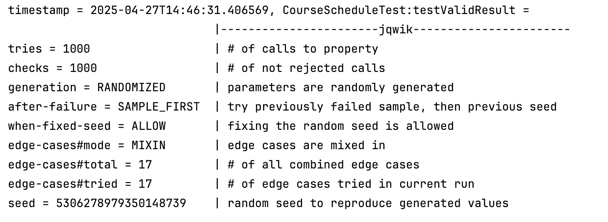
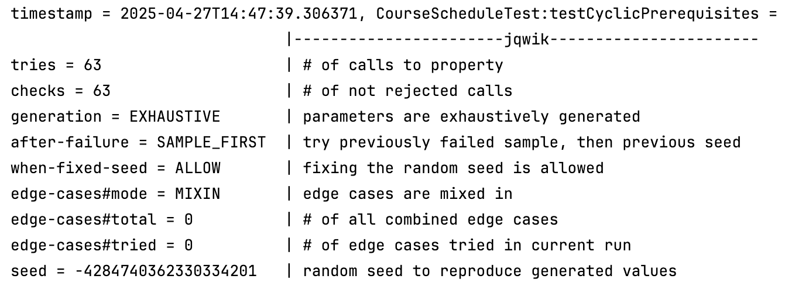

# solution_CourseSchedule

## Task 1: Code Coverage Test

- Check valid prerequisites
   1. one prerequisite: {0, 1}
   2. conflict prerequisite: {0, 1}, {1, 0}
   3. linked prerequisite: {1, 0}, {2, 1}, {3, 2}
   4. two prerequisites for one course: {0, 2}, {1, 2}
   5. cyclic prerequisite: {0, 1}, {1, 2}, {2, 0}
   6. self prerequisite: {1, 1}
   7. independent prerequisites: {1, 2}, {0, 3}

## Task 2 & 3: Desinging and Testing Contracts
1. Check preconditions
   - numCourses cannot be null
   - 1 <= length of numCourses <= 64
   - 0 <= length of prerequisites <= 64
   - prerequisites can be empty list
   - prerequisites should contain each pair of courses
   - Each element of prerequisite must be less than numCourses - 1

2. Check postconditions
   - Return value should be true or false

All tests are passed

## Task 4: Property-Based Testing
1. If `numCourses` and `prerequisites` are valid, the program should always return boolean (true or false) value
   
2. If `prerequisites` is in cyclical  conditions, the program should return false
   