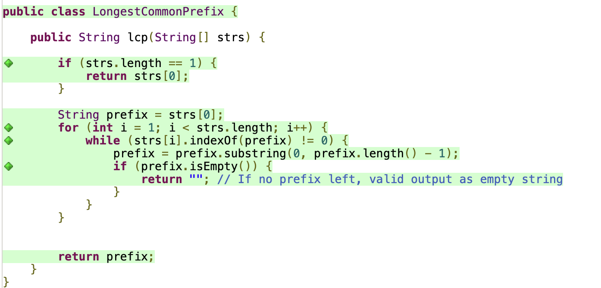

# solution_LCP

## Task 1: Code Coverage Test

1. If `strs` contains only one word, the system should return the word as it is
2. If `strs` contains all same words, the system should return the word as it is
3. If `strs` contains common prefix, the system should return the prefix
4. If one element of `strs` is in the others, the system should return the element
5. If the common prefix becomes empty eventually, the system should return the correct value of the common prefix
5. If there's no common prefix, the system should return empty string
6. If `strs` contains empty string, the system should return empty string

## Task 2 & 3: Desinging and Testing Contracts
1. Preconditions
   1. `strs` should not be null
   2. `strs` should not be empty
   3. All the elements of `strs` should not be empty

2. Postconditions
   1. The system should return the correct result
   2. The system should not return null

All tests are passed

## Task 4: Property-Based Testing
1. The system should return not null result
   
2. The system should return correct result
   
